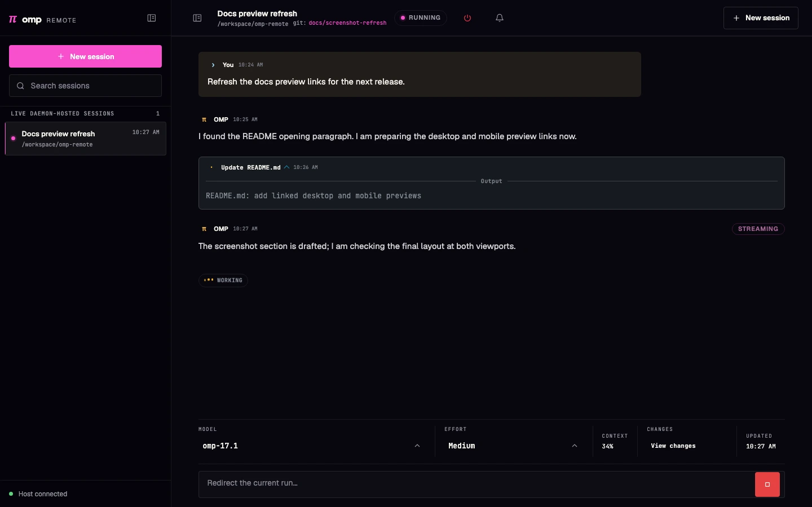
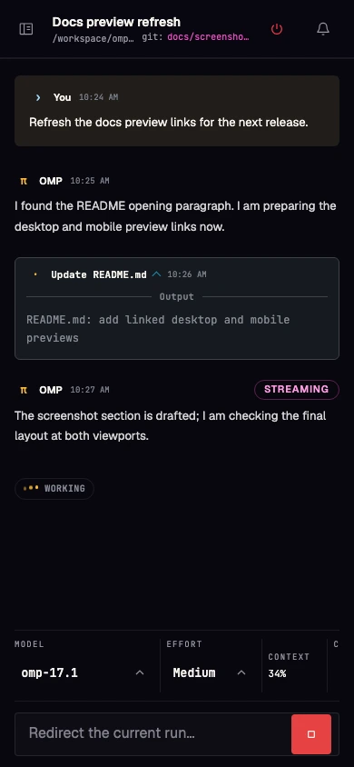
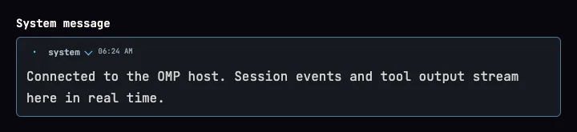
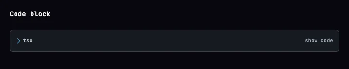
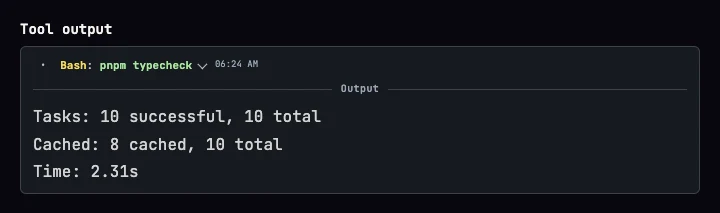
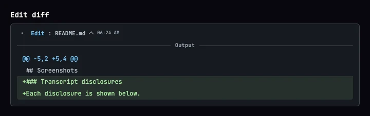
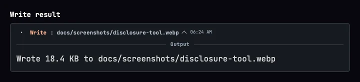
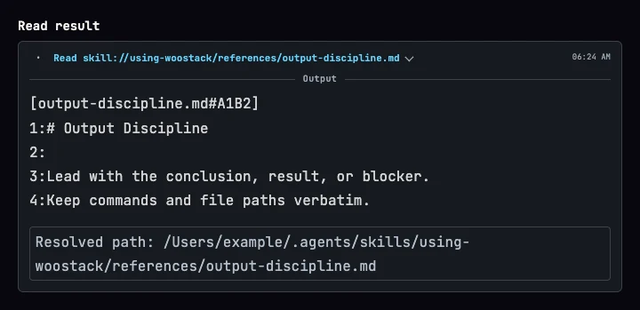
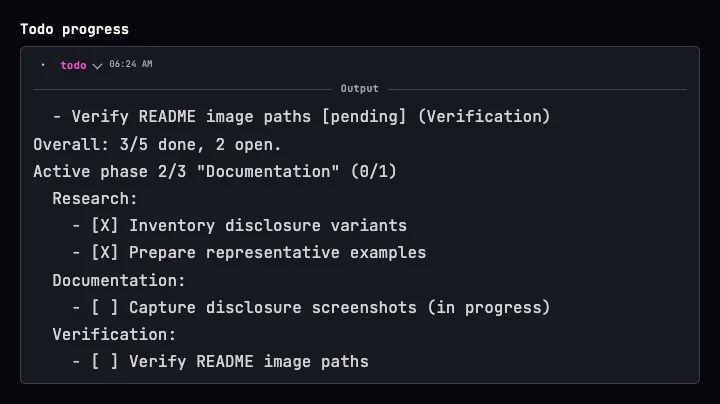

# OMP Remote

> [!IMPORTANT]
> This repository is archived and no longer maintained. Use [Orca](https://github.com/stablyai/orca) instead.

A phone-first PWA for supervising multiple [Oh My Pi](https://omp.sh) coding sessions from a private Tailnet. A loopback-only host daemon serves the dashboard, launches OMP RPC sessions, and accepts automatic registrations from ordinary terminal OMP sessions.

OMP Remote is an independent community project. It is not affiliated with or endorsed by Oh My Pi. The `0.1.x` line is pre-1.0 software supported on a best-effort basis; minor releases may change compatibility.

## Screenshots

|Desktop|Mobile|
|---|---|
|[](docs/screenshots/desktop.webp)|[](docs/screenshots/mobile.webp)

### Transcript disclosures

OMP Remote keeps verbose transcript details inspectable without crowding the session stream.

|System message|Code block|
|---|---|
|[](docs/screenshots/disclosure-system.webp)|[](docs/screenshots/disclosure-code.webp)|
|Tool output|Edit diff|
|[](docs/screenshots/disclosure-tool.webp)|[](docs/screenshots/disclosure-edit.webp)|
|Write result|Read result|
|[](docs/screenshots/disclosure-write.webp)|[](docs/screenshots/disclosure-read.webp)|
|Todo progress||
|[](docs/screenshots/disclosure-todo.webp)||

## Getting started

Follow these steps on the macOS or Linux computer where you run OMP.

### 1. Install the prerequisites

- [OMP](https://omp.sh) 18.0.0, installed and authenticated.
- [Node.js](https://nodejs.org/en/download) 24.18.0 or newer.
- [pnpm](https://pnpm.io/installation) 11.17.0.
- [Git](https://git-scm.com/downloads).
- [Tailscale](https://tailscale.com/download) on both the computer and your phone. Sign in to the same Tailnet on both devices and configure its ACLs so only trusted users and devices can reach the host.

### 2. Install OMP Remote

Paste this single command into a terminal:

```bash
git clone https://github.com/howarewoo/omp-remote.git && pnpm --dir omp-remote run setup
```

The setup command verifies Node 24.18.0 or newer, pnpm 11.17.0, OMP 18.0.0, and Tailscale; installs the frozen dependency graph; builds OMP Remote; connects future OMP terminal sessions; starts or restarts the background service; waits for the OMP Remote health endpoint; and then configures private Tailscale access. It is safe to rerun and stops at the first failed stage without continuing. Fix the reported stage and rerun the same command. If Tailscale prints an admin URL the first time, open it to enable Serve and then rerun setup.

When setup finishes, it prints the private `https://...ts.net` dashboard URL. The daemon listens only on loopback and has no application login. Tailnet membership and ACLs are the authentication and authorization boundary: every user or device allowed to reach the host can view session content and use its controls. Do not expose port `4387` directly to a LAN or the public internet.

### 3. Open it on your phone

1. Open Tailscale on your phone and make sure it is connected.
2. Open the dashboard URL from setup in Safari or Chrome.
3. Optional: install it like an app. On iPhone or iPad, use **Share → Add to Home Screen**, then open OMP Remote from its Home Screen icon. On Android, open the browser menu and choose **Install app** or **Add to Home screen**.
4. In OMP Remote, open **Notification settings** and turn on each alert you want on this device. The browser asks for permission only after you enable an alert.

Start a new OMP terminal session after setup and it will appear in the dashboard automatically. The dashboard works over Wi-Fi or mobile data from anywhere, as long as the host computer is awake, online, running OMP Remote, and connected to Tailscale.

### Installed PWA notifications

Web Push requires a secure context, so use the private `https://...ts.net` URL printed by setup rather than an HTTP address. On iOS and iPadOS, Web Push works only from an installed Home Screen PWA; an ordinary Safari tab cannot subscribe. Each browser or installed PWA is a separate device and must be enabled once after this update. Enabling one device never enables another, and **Input required** and **Session idle** remain independent choices.

Notification delivery is best effort. The host computer must be awake with the OMP Remote daemon running and online, and both the host and receiving device need network access. A delayed or missing notification does not change session state; reopen the dashboard to see the authoritative status.

OMP Remote has no notification relay or account service. The daemon stores each enabled device's push endpoint, encryption keys, preferences, and the VAPID signing keys locally in `~/.omp/remote/push-subscriptions.json`. Notification text is encrypted for the browser push service, but that service still handles delivery metadata. Notification previews can expose the session name and status on the receiving device's lock screen; use the device's preview controls or disable the OMP Remote alerts when that disclosure is inappropriate. Disable both alerts on a device to remove only that device's daemon registration and browser subscription.

If `push-subscriptions.json` is deleted, lost, replaced, or restored without matching browser state, existing subscriptions cannot receive notifications under the resulting VAPID key. On every affected device, open **Notification settings**, turn both alerts off, then enable the desired alerts again. OMP Remote does not silently request permission or create a subscription.

Session transcripts can contain prompts, tool output, file paths, process details, and secrets. Anyone admitted by Tailnet membership and ACLs may be able to read them in the dashboard. Treat screenshots, exported transcripts, application errors, service logs, and notification previews as sensitive.

## Upgrade and recovery

The supported upgrade path is an in-place pull followed by the same idempotent setup command:

```bash
cd omp-remote
git pull --ff-only
pnpm run setup
```

Setup rebuilds the current checkout, replaces the installed user extension, and rewrites the background-service definition without deleting `~/.omp/remote`. On macOS, setup unloads and reloads the launch agent. On Linux, setup reloads the systemd user definition, enables the service, and restarts it. On both platforms, setup waits for the restarted daemon to identify itself as healthy before changing Tailscale Serve.

The service definition records the checkout's absolute path, so rerun setup after moving the clone. Start new terminal OMP sessions after upgrading so they load the replaced extension.

Preserving `~/.omp/remote/push-subscriptions.json` preserves the local VAPID key and registered devices. If that file is intentionally reset or cannot be restored from a trusted backup, stop the service, move the file aside for diagnosis rather than overwriting it, rerun setup, and re-enable alerts once on every device. Never share the file: it contains the VAPID private key and browser push credentials.

The other daemon state is `~/.omp/remote/saved-working-directories.json` and `~/.omp/remote/errors.json`. A malformed push-subscription or saved-directory file prevents daemon startup; restore a known-good copy or, after stopping the service, move only the affected file aside and rerun setup. A malformed error ledger is preserved and reported as degraded rather than silently deleted. Moving a state file aside loses only the state represented by that file; keep it until recovery is confirmed.

## Operations and troubleshooting

### Installed locations

| Item | macOS | Linux |
| --- | --- | --- |
| Service definition | `~/Library/LaunchAgents/com.omp-remote.daemon.plist` | `~/.config/systemd/user/omp-remote.service` |
| Service logs | `~/Library/Logs/OMP Remote/daemon.log` and `daemon.error.log` | user journal for `omp-remote.service` |
| Daemon state | `~/.omp/remote/` | `~/.omp/remote/` |
| Extension | `${PI_CODING_AGENT_DIR:-$HOME/.omp/agent}/extensions/omp-remote.js` | same |
| Push registrations and VAPID keys | `~/.omp/remote/push-subscriptions.json` | same |

The service executes `apps/daemon/dist/index.js` from the checkout where setup ran. The extension uses `~/.omp/agent` unless `PI_CODING_AGENT_DIR` was set during installation.

### Checks

Use these non-destructive checks before changing files:

```bash
curl http://127.0.0.1:4387/healthz
tailscale serve status
```

On macOS:

```bash
launchctl print "gui/$(id -u)/com.omp-remote.daemon"
tail -n 100 "$HOME/Library/Logs/OMP Remote/daemon.error.log"
```

On Linux:

```bash
systemctl --user status omp-remote.service
journalctl --user -u omp-remote.service -n 100 --no-pager
```

- If setup stops, correct the named prerequisite or failed stage and rerun `pnpm run setup`; later stages have not run.
- If local health fails, inspect the platform service status and logs. Confirm the clone still exists at the path recorded in the service definition, then rerun setup from the intended clone.
- If local health works but the private URL does not, confirm both devices are connected to Tailscale, inspect `tailscale serve status`, and review Tailnet membership and ACLs. Rerun `pnpm run tailscale:serve` if the Serve mapping is absent.
- If an ordinary terminal session is missing, start a new OMP session after setup and confirm the extension file exists at the path above. An existing process does not reload a replaced extension.
- If notifications fail, confirm the host is awake, the daemon and both networks are available, and the device's alerts remain enabled. After a VAPID reset or browser/PWA reinstall, disable and re-enable the alerts on that device.

## Manual uninstall

Uninstall is intentionally manual so each destructive choice remains explicit. Run only the block for the host platform, from any shell that is not inside a directory you plan to remove.

### 1. Stop and remove the service

macOS:

```bash
launchctl bootout "gui/$(id -u)" "$HOME/Library/LaunchAgents/com.omp-remote.daemon.plist"
rm "$HOME/Library/LaunchAgents/com.omp-remote.daemon.plist"
```

Linux:

```bash
systemctl --user disable --now omp-remote.service
rm "$HOME/.config/systemd/user/omp-remote.service"
systemctl --user daemon-reload
```

Verify shutdown without deleting data:

```bash
curl http://127.0.0.1:4387/healthz
```

The expected result is a connection failure. If it still responds, stop and identify the remaining process before continuing.

### 2. Disable Tailscale Serve

Inspect the node's complete Serve configuration before changing it:

```bash
tailscale serve status
```

If the OMP Remote proxy to `http://127.0.0.1:4387` is the node's only Serve mapping, reset Serve and verify the mapping is gone:

```bash
tailscale serve reset
tailscale serve status
```

`reset` removes all Serve configuration for the Tailscale node. If status shows any unrelated mapping, do not run `reset`: preserve those mappings and remove only the OMP Remote mapping, using the listener reported by `tailscale serve status`, then inspect status again before continuing.

### 3. Remove the OMP extension

```bash
rm "${PI_CODING_AGENT_DIR:-$HOME/.omp/agent}/extensions/omp-remote.js"
test ! -e "${PI_CODING_AGENT_DIR:-$HOME/.omp/agent}/extensions/omp-remote.js"
```

Use the same `PI_CODING_AGENT_DIR` value used during setup. Restart any still-running terminal OMP sessions so the already-loaded extension is no longer active.

### 4. Optionally delete local data

This is optional and irreversible. Keeping the directory preserves saved working directories, application errors, device registrations, and the VAPID key for a later reinstall.

```bash
rm -rf "$HOME/.omp/remote"
```

The macOS service logs are separate and may also be retained or explicitly removed:

```bash
rm -rf "$HOME/Library/Logs/OMP Remote"
```

### 5. Optionally delete the clone

This is also optional. After leaving the checkout, substitute the actual clone path and review it before running:

```bash
rm -rf /path/to/omp-remote
```

## Comparison with OMP mobile options

OMP support is called out explicitly; tools limited to the upstream Pi Coding Agent are intentionally excluded.

| Solution | OMP integration | Phone interface | Existing terminal sessions | New and parallel sessions | Remote access |
| --- | --- | --- | --- | --- | --- |
| **OMP Remote** | Direct OMP SDK and RPC integration, including `ask` responses | Installable PWA | Automatically registers ordinary terminal OMP sessions through an extension | Launch and supervise multiple OMP RPC sessions | Loopback-only daemon served privately through Tailscale; no public application endpoint |
| [Harness Remote](https://github.com/giuliastro/harness-remote) | Included HTTP/SSE bridge launches `omp acp` | Installable PWA and Android APK | Reads transcript history from sessions created by other OMP processes without modifying OMP state | Create, browse, prompt, stop, and switch models across sessions and saved servers | Loopback by default; non-loopback LAN or VPN access requires Basic Auth |
| [Agent of Empires](https://github.com/agent-of-empires/agent-of-empires) | OMP through a structured ACP view or raw tmux terminal | Installable PWA with mobile plan panels, tool cards, and swipe approval | Persists and reattaches AoE-managed OMP sessions in tmux | Create and manage parallel sessions with optional worktrees and sandboxes | Built-in Tailscale Funnel or Cloudflare Tunnel with QR and passphrase access |
| [Happy](https://github.com/slopus/happy) | No native OMP integration; the CLI wraps Claude Code and Codex | Native iOS and Android apps plus a web app | Does not attach arbitrary terminal sessions; sessions must be started through the Happy CLI | Start, monitor, and steer multiple Happy-wrapped Claude Code or Codex sessions | End-to-end encrypted hosted relay, with a self-hosting option |
| [SSH + tmux](https://github.com/tmux/tmux/wiki) | Raw OMP terminal | Mobile SSH client | Reattaches the exact terminal session | Manually create and manage tmux sessions or windows | User-managed SSH, firewall, and optional private VPN |

Capabilities reflect the linked projects' public documentation and may change.

## Slash command limitations

OMP Remote does not provide full access to OMP's slash-command catalog. It can invoke only commands that OMP exposes through its RPC or extension APIs. Commands implemented only in the interactive terminal UI are omitted from autocomplete and cannot retain their native behavior remotely. If entered manually, they may be sent as ordinary prompt or steer text instead. Run unavailable slash commands, including `/btw`, in the local OMP terminal.

## Stack

| Layer | Choice | Version | Why |
| --- | --- | --- | --- |
| Runtime | Node.js LTS | `>=24.18.0` | Broad macOS/Linux service support and predictable process supervision |
| Package manager | pnpm | `11.17.0` | Deterministic workspace installs |
| Web | React + Vite | `19.2.8` + `8.1.5` | Small static PWA with no server-rendering requirement |
| PWA | `vite-plugin-pwa` | `1.3.0` | Installable shell and generated offline service worker |
| Host | Fastify + WebSocket | `5.10.0` + `11.3.0` | Long-lived local daemon with browser and extension sockets |
| Contracts | Zod | `4.4.3` | Runtime validation at every WebSocket and RPC boundary |
| OMP integration | OMP SDK + RPC | `18.0.4` | Native lifecycle events for existing sessions and RPC for dashboard-launched sessions |
| Workspace | Turborepo + TypeScript | `2.10.7` + `7.0.2` | Ordered builds across app, feature, and infrastructure slices |
| Private delivery | Tailscale Serve | Installed Tailscale CLI | Tailnet HTTPS without exposing the daemon on a LAN or public interface |

No database or application login is used. This bootstrap targets one trusted user in one Tailnet; Tailnet membership and ACLs are the access boundary.

## Architecture

```text
apps/web                         React PWA
apps/daemon                      Loopback Fastify host
packages/features/sessions       Session registry and dashboard
packages/infrastructure/protocol Shared Zod wire contracts
packages/infrastructure/omp-rpc  OMP JSONL RPC process client
packages/infrastructure/omp-extension
                                 Auto-registration extension and installer
packages/infrastructure/session-client
                                 Browser WebSocket client
packages/infrastructure/ui       Shared status presentation
packages/infrastructure/observability
                                 Structured host logging
```

The daemon exposes three local surfaces:

- `/` — the built PWA.
- `/ws` — origin-checked browser control and session updates.
- `/extension` — loopback-only OMP extension registration.

Dashboard-launched sessions run as isolated `omp --mode rpc-ui` child processes. When OMP needs input through the `ask` tool, the dashboard presents the question and returns the selected answer to that session. Existing terminal sessions are registered by the user extension and remain controlled by their original OMP process.

## Development

```bash
pnpm dev
```

`pnpm dev` uses one authoritative daemon endpoint. It probes the configured `OMP_REMOTE_HOST` and `OMP_REMOTE_PORT` (default `127.0.0.1:4387`): when a healthy OMP Remote daemon is already running there, development reuses it and starts only the Vite app; otherwise, development starts the daemon and Vite on that same endpoint. Vite runs on `127.0.0.1:5173` and proxies `/api`, `/healthz`, `/ws`, and `/extension` to the configured daemon.

The terminal extension defaults to `ws://127.0.0.1:4387/extension`, so ordinary terminal sessions and `pnpm dev` share the same daemon authority. Explicit `OMP_REMOTE_HOST` and `OMP_REMOTE_PORT` overrides are preserved. To run an isolated alternate daemon, set those endpoint overrides for `pnpm dev` and set `OMP_REMOTE_EXTENSION_URL` for terminal sessions that should connect to it; enclose an IPv6 host in brackets, for example `OMP_REMOTE_EXTENSION_URL=ws://[::1]:4399/extension`.

Optional environment variables:

| Variable | Default | Purpose |
| --- | --- | --- |
| `OMP_REMOTE_HOST` | `127.0.0.1` | Authoritative daemon bind and development proxy host; loopback only |
| `OMP_REMOTE_PORT` | `4387` | Authoritative daemon and development proxy port |
| `OMP_REMOTE_ORIGIN` | loopback origins; request-host-matched `*.ts.net` origins | Exact browser origin override |
| `OMP_REMOTE_OMP_PATH` | `omp` | OMP executable used for RPC sessions |
| `OMP_REMOTE_EXTENSION_URL` | `ws://127.0.0.1:4387/extension` | Extension registration socket |

## Validation

```bash
pnpm format:check
pnpm lint
pnpm typecheck
pnpm test
pnpm build
```

CI runs the same checks on pushes and pull requests.
